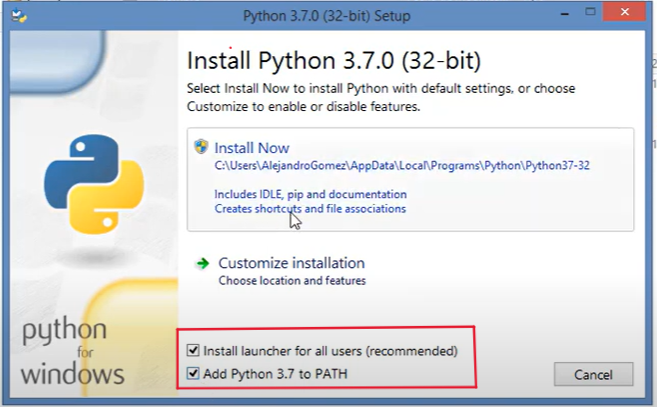

# SmartPort
Proyecto de Software, digitalizar transporte publico

## Prototipo Funcional.

Se uso Flask para el backend, la razón es que nos enteramos que no se podia el martes de la semana de entrega, y otro trabajo mas pronto nos consumio todo el tiempo, asi que no pudimos pasar de Flask a ExpressJS como inicialmente queriamos.

Se debe tener instalado NodeJS, Ionic, XAMPP y Python (con el PATH activo, es lo que permite instalar librerias con pip).

Cuando se instala Python, se debe marcar la opción de "Add Python (version) to PATH". Agregarlo manualmente puede ser complicado, pese a la cantidad de tutoriales en youtube. Se recomienda borrar y volver a instalar marcando la casilla "Add Python (version) to PATH" en lugar de añadir python al PATH de windows manualmente.

Una vez instalado Python con el PATH añadido, se dirigen a la carpeta BackEnd por consola **cmd**, y ejecutan el comando 
~~~
py libreries.py
~~~

Ahora debemos inicializar el prototipo en el siguiente orden.

### 1. Iniciar la Base de Datos SQL con XAMPP

Primero preparemos XAMPP, siga las siguientes instrucciones **EN ORDEN**.

1. Iniciar apache en XAMPP

2. Iniciar mysql en XAMPP

3. Ahora con todo iniciado deberia verse asi (**IMPORTANTE:** el puerto en MySQL debe ser $3306$)

4. Ahora, en MySQL presionamos Admin.

5. Se abre una pestaña en el navegador, se debe presionar importar.

6. En importar se debe presionar selecciónar archivo.

7. Se debe importar el sql que se encuentra en el Github.

8. Ahora, en el menu de la izquierda, debio aparecer SmartPort, al hacerle clik podremos ver sus tablas.

9. Si hacemos click en la tabla usuario en la izquierda, podremos ver que viene con datos.

### 2. Tener 2 terminales.

1. Abrir VSCode con el proyecto SmartPort del GitHub. Se abrira una nueva terminal

2. La terminal abierta es powershell, pero requerimos cmd. Apretamos una flecha hacia abajo en el mas y luego seleccionamos "Command Prompt" para agregar una nueva terminal cmd

3. Luego borramos la terminal powershell, y nos quedaria la terminal de la siguiente manera, con 2 cmd entre las que podemos intercambiar.

4. Ahora Volvemos a la flechita hacia abajo, que esta al lado del +. Ponemos el mouse en "Split Terminal" y seleccionamos el "Command Prompt" que aparece.

5. Nos quedaria de la siguiente manera

### 2. Iniciar BackEnd (asumiendo que las librerias ya estan instaladas).

1. Iniciaremos el backend en la terminal izquierda, primero tenemos que dirigirnos a Backend con
~~~
cd BackEnd
~~~

2. En la consola usar el comando
~~~
py app.py
~~~

- Se debe tener ejecutandose en todo momento para que el frontend funcione.

- Si se quiere detener, es entrar a la consola con clock izquierdo y presionar las teclas "ctrl + c" simultaneamente. 

### 2. Iniciar BackEnd (asumiendo que las librerias ya estan instaladas).

1. Iniciaremos el forntend en la terminal derecha, primero tenemos que dirigirnos a Frontend con
~~~
cd FrontEnd
~~~

2. Primero se deben instalar las dependencias en el FrontEnd, en la consola usar el comando
~~~
npm install
~~~

- Tardara unos minutos. En la imagen sale 2 segundos porque ya estaban instaladas.

3. Ahora se inicia el frontend (recordar que XAMPP y Backend deben star corriendo) con el comando
~~~
ionic serve
~~~

- Para una mejor experiencia, usar herramientas de desarrollador para verlo en una pantalla tamaño celular (despues de todo se diseño para ser aplicación movil).

